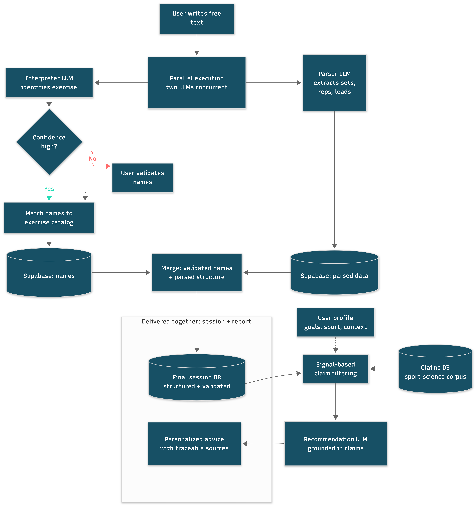
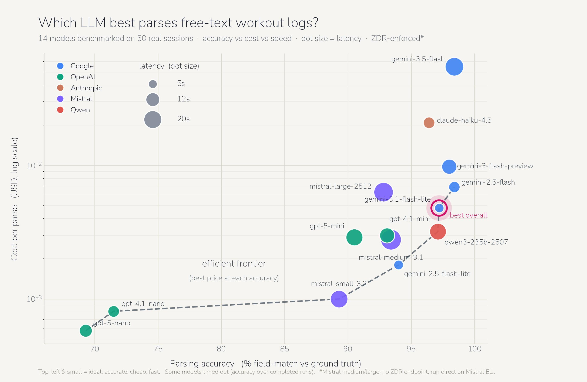

# CalenFit — Architecture Write-up

> Turning free-text workout notes into structured, validated training data with an agentic two-LLM pipeline — shipped to production on iOS and Android.

[](https://apps.apple.com/us/app/calenfit-fitness-tracker/id6760555640)
[](https://play.google.com/store/apps/details?id=app.fitboard.mobile)
[](https://calenfit.com)

This repository is **not** the CalenFit codebase. It's a public write-up of the system design and the production engineering behind it. CalenFit is a live AI fitness app; this document explains how its core works and the trade-offs I made to ship it reliably to real users.

---

## The problem

Logging workouts is a key process to progress when you go to the gym. Problem: most app interfaces are rigid and don't let the users write their notes as they want. Many formats are usually not available and users end up logging their workouts on notebooks, agenda or quick note apps. Like me. So I decided to build an app that let users log workouts the way they naturally write them, not the way software wants to receive them.

To a human, these are obviously the same session:

```
DL 100kgx8 / 100x8 / 8@100
deadlift 100 3x8
```

To software, they're two incompatible inputs. Most fitness apps use dropdowns, steppers and fixed fields to solve the issue. That's reliable but it fights how people actually think about their training and it cannot handle specific workout formats. The open question I wanted to test was simple: **can an LLM pipeline parse free-text workouts into structured data reliably enough to actually ship?**

It can. CalenFit runs that pipeline in production today.

---

## System overview

The core is an **agentic two-LLM pipeline**: instead of one large prompt doing everything, the problem is split across two specialized models that run concurrently, each with a narrow job.

<p align="center">
  
</p>

---

## The agentic core: interpreter + parser

The key design decision was **not** to ask one model to do everything. Two narrow prompts proved far more reliable than one large one — each model has a well-bounded responsibility, which makes its output easier to constrain and validate. And it solves at once reliability and latency (see below, Validation as UX).

**Interpreter** — resolves *what exercise this is*. It handles abbreviations (`DL` → deadlift), shorthand, ambiguous names like `biceps` (Biceps curl, preacher curl, ...?) and misspellings, mapping messy free-text to a canonical exercise.

**Parser** — extracts *the structure*: sets, reps, loads, formats, user comments and other set-level data, normalizing the many ways people write the same thing (`3x8`, `8/8/8`, `8 reps 3 sets`) into one schema.

The two run **concurrently**, which is what makes the latency budget work (see below).

### Validation as UX

When the interpreter is **uncertain** about an exercise, I don't silently guess and I don't make the user wait. I surface a quick **confirmation card** — and I surface it *during the parser's background inference*. The user resolves the ambiguity in the exact window where they'd otherwise just be waiting.

The unavoidable latency of LLM inference becomes a **human-in-the-loop validation step**. It guarantees data integrity at the source without the user ever feeling a delay. Validation isn't bolted on after the fact — it's designed into the interaction.

---

## The production layer

The agentic idea is only useful if it's dependable. Most of the real engineering was everything *around* the models.

### Reliability

Every model call flows through a single **`LLMClient`** gateway, which centralizes the failure handling:

- **Retry** on transient errors.
- **Malformed-output detection** — catch responses that don't conform to the expected schema before they reach the user.
- **Automatic fallback** to a secondary model when the primary fails.
- A **frontend retry** as a final safety net if the upstream layers fail.
- **Sentry logging** throughout for full observability into what's failing and why.

Funneling every call through one client means reliability logic lives in exactly one place instead of being scattered across call sites.

### Latency

LLM tail latency is the enemy of a "feels instant" logging experience. I measured the real distribution across many runs and found an upper-percentile threshold around **~9s** for the model I currently use. Calls that exceed that threshold are caught and **re-issued**, which clips the worst-case wait rather than letting an unlucky request hang the interaction and destroy the frontend flow. Combined with the concurrent interpreter/parser design and the confirmation-card-during-inference pattern, the perceived latency stays low.

### Cost

I **benchmarked candidate models** against each other on three axes — cost, accuracy, and latency — and picked the best trade-off rather than defaulting to the most capable model. That benchmarking cut inference cost roughly **2×** versus the model I started with, with no meaningful accuracy loss for this task. The comparison below summarizes the trade-off I based the decision on.

<p align="center">
  
</p>

The choice wasn't only cost and latency. Shipping to real EU users means the pipeline handles personal data under **GDPR**, so model selection was also constrained by data-handling guarantees — only providers offering **Zero Data Retention (ZDR)** were eligible (see the ZDR column above). Compliance isn't an afterthought you bolt on; it's a hard constraint on the architecture, and it's the kind of requirement you only really meet once you're in production with real data.

---

## Stage 3: insights & evidence-based recommendations

Once a session is structured, a third stage turns the data into insights and AI recommendations. I deliberately did **not** let a model free-associate advice.

Instead, I built **deterministic structured retrieval**: a curated knowledge base of sport-science claims, each categorized and tagged with **signals that fire deterministically against the user's data and goals**. Only the claims whose signals match get injected into the recommendation prompt.

The result is advice that's **traceable and evidence-based** — every recommendation can be traced back to a specific, vetted claim that fired for a specific reason in the user's data, rather than plausible-sounding text with no provenance.

---

## Links

- **App Store:** https://apps.apple.com/us/app/calenfit-fitness-tracker/id6760555640
- **Google Play:** https://play.google.com/store/apps/details?id=app.fitboard.mobile
- **Website:** https://calenfit.com

---

*CalenFit is a live, production AI fitness application. This repository documents its architecture; it does not contain proprietary source code.*
